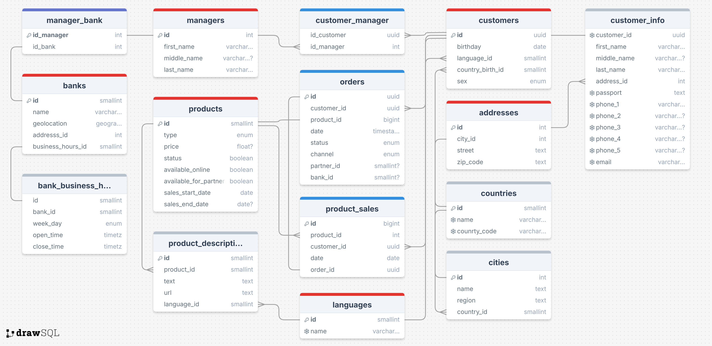

Учебная ER‑модель для учёта продаж финансовых продуктов банка по различным каналам.  

# Описание  
Банк реализует такие виды финансовых продуктов, как кредиты, вклады, платёжные карты, страховые полисы.  

Для каждого продукта в базе хранятся:  
- уникальный идентификатор;
- категория (тип) продукта;
- текущий статус (активен/неактивен);
- доступность для продажи в мобильном/веб‑приложении;
- даты запуска прямых продаж в офисах и онлайн;
- флаг допуска к реализации через партнёрские каналы;
- цена (если применимо) и ссылка на страницу продукта на сайте банка.

Поскольку интерфейс и сайт поддерживают несколько языков, на разных языках сохраняются наименование и описание каждого продукта.  

## Отделения банка  
- Каждому филиалу присвоен уникальный код и наименование;
- фиксируются часы работы;
- указывается географическое положение (координаты или адрес).

## Клиенты  
- У каждого клиента есть собственный идентификатор;
- в профиле сохраняются: полное имя, адрес (улица, город, страна, почтовый индекс), до пяти телефонных номеров;
- для заявок через партнёров фиксируются электронные адреса;
- регистрируется родной язык и регион проживания;
- при наличии закреплённого менеджера - его данные.  

## Заявки на продукт  
- Для каждой заявки фиксируются дата и время оформления;
- канал подачи (офис, онлайн‑приложение или через партнёра).

