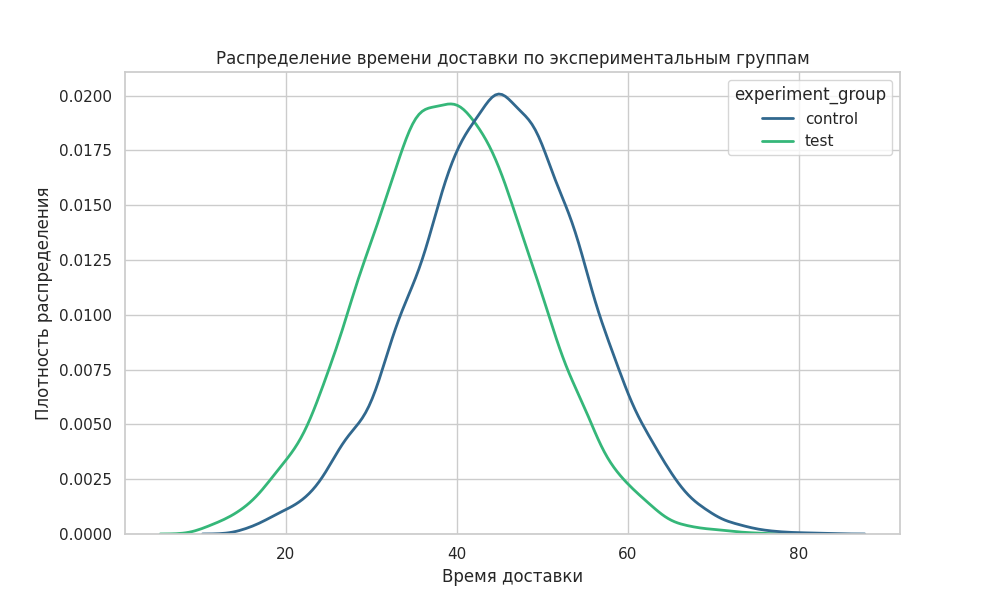

# Проект: Анализ времени доставки еды (t-тест)  

## Цель:  
Сравнить среднее время доставки до и после внедрения улучшений.  

## Описание данных  
CSV с симулированными данными:  
- `order_id`  
- `delivery_time`
- `district`
- `experiment_group`

## Методология  
Парный t-тест (т.к. измерения зависимые).  

Гипотезы:  
- $H_0$: Время доставки не изменилось ($\mu_{test} - \mu_{control} = 0$).  
- $H_1$: Время доставки изменилось ($\mu_{test} - \mu_{control} \neq 0$).  

Уровень значимости: $\alpha = 0.05$

## Используемые инструменты  
Пакеты Python: `pandas`, `scipy`, `seaborn`.  

## Результаты  
Статистически значимое уменьшение времени доставки. 

